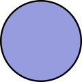

# R Consortium Artwork and Logos

*Note: GitHub Flavored Markdown used in the Readme doesn't support background colors. The white logos below are displayed on the light grey of tables.*

## R Consortium

### Color Palette

<table style="text-align:center">
	<tr>
		<th colspan=3>
	</tr>
		<th></th>
		<th width="150">RGB</th>
		<th width="150">CMYK</th>
		<th width="150">Pantone</th>
		<th width="150">Hex</th>
	</tr>
		<td></td>
		<td>(0, 71, 186)</td>
		<td>(100, 62, 0, 27)</td>
		<td>2728 C</td>
		<td>#0047BA</td>
	</tr>
	</tr>
		<td></td>
		<td>(150, 156, 222)</td>
		<td>(32, 30, 0, 13)</td>
		<td>3558 C</td>
		<td>#969CDE</td>
	</tr>
	</tr>
		<td></td>
		<td>(33, 35, 34)</td>
		<td>(32, 30, 0, 13)</td>
		<td>419 C</td>
		<td>#212322</td>
	</tr>

</table>

### Logos

<table>
    <tr>
    	<th colspan="7"></th>
    </tr>
    <tr>
        <th></th>
        <th colspan="3">PNG</th>
        <th colspan="3">SVG</th>
    </tr>
    <tr>
        <th></th>
        <th>horizontal</th>
        <th>vertical</th>
        <th>icon</th>
        <th>horizontal</th>
        <th>vertical</th>
        <th>icon</th>
    </tr>
    <tr>
        <th>color (for dark backgrounds)</th>
        <td></td>
        <td></td>
        <td></td>
        <td></td>
        <td></td>
        <td></td>
    </tr>
    <tr>
        <th>color</th>
        <td></td>
        <td></td>
        <td></td>
        <td></td>
        <td></td>
        <td></td>
    </tr>
    <tr>
        <th>white</th>
        <td></td>
        <td></td>
        <td></td>
        <td></td>
        <td></td>
        <td></td>
    </tr>
    <tr>
        <th>black</th>
        <td></td>
        <td></td>
        <td></td>
        <td></td>
        <td></td>
        <td></td>
    </tr>
</table>

---

Use of any trademark or logo is subject to the trademark policy available at [https://www.linuxfoundation.org/trademark-usage](https://www.linuxfoundation.org/trademark-usage)

Questions? Please email [info@r_consortium.org](mailto:info@r_consortium.org).
